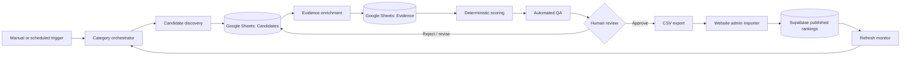

# Ranking Automation Architecture

**Project:** Ranking Site  
**Orchestrator:** n8n  
**Working store (v1):** Google Sheets  
**Published store:** Supabase  
**Status:** Proposed architecture  
**Last updated:** July 16, 2026

---

## 1. Objective

Build a repeatable system that researches, scores, reviews, and exports credible
rankings for the site's **25 categories** (Top 20 each). The system should reduce
manual research without allowing an AI model to invent candidates, evidence, or
scores.

The first production target is **Best AEO Agencies**. Once that workflow is
reliable, reuse it for related categories.

### Success criteria

- Every published item has a real name, canonical URL, and supporting sources.
- Every score can be reconstructed from a documented rubric.
- Every factual blurb is grounded in stored evidence.
- A human approves every item and final ordering before publication.
- The final output matches the website CSV importer:
  `rank,name,blurb,score,url`.
- Rerunning a workflow does not create duplicate candidates.
- Sources and rankings have verification dates so stale data can be refreshed.

### Non-goals

- Automatically copying another publisher's ranking.
- Treating an LLM response as evidence.
- Publishing directly from an unreviewed research run.
- Scraping sources that prohibit automated access.
- Producing all 500 entries before validating one category end to end.

---

## 2. Operating principles

1. **Evidence before prose.** Gather facts and source URLs before asking an LLM
   to summarize anything.
2. **Deterministic scoring.** n8n calculates weighted scores from structured
   evidence. The LLM may classify evidence but must not choose the final score
   without recorded inputs.
3. **Human approval is a publication gate.** Only rows marked `Approved` can
   appear in the export.
4. **Original rankings.** Other directories can help discover candidates, but
   their ordering, scores, reviews, and descriptions are not copied.
5. **Source-aware research.** Each category defines approved source types,
   blocked domains, rubric weights, and minimum evidence requirements.
6. **Start narrow.** Pilot with 10–15 AEO agencies, review quality, then expand
   toward 20.
7. **Preserve an audit trail.** Keep source URL, retrieval date, extracted fact,
   scoring decision, workflow run ID, and reviewer status.

---

## 3. High-level architecture



### System boundaries

- **n8n:** orchestration, API calls, transformations, retries, alerts, and file
  generation.
- **Google Sheets:** visible research queue, evidence, rubric configuration,
  review status, and export staging.
- **LLM:** extraction, classification, deduplication assistance, and original
  blurb drafting from supplied evidence.
- **Search/data providers:** candidate discovery and factual inputs.
- **Supabase:** authenticated admin access and published website data.
- **Website admin:** final import and explicit `Save & publish`.

Supabase should not be the research workspace. Google Sheets is easier to audit
and edit during the pilot. Move the research store to Postgres only when Sheets
becomes a scale or concurrency bottleneck.

---

## 4. Google Sheets workbook

Use one workbook named **Ranking Website — Research Pipeline**.

### `Categories`

One row per ranking category:

```text
category_name
category_slug
group
status
methodology
target_item_count
minimum_sources
refresh_days
rubric_id
allowed_source_types
blocked_domains
last_started_at
last_completed_at
```

Suggested statuses:

```text
Not started
Discovering
Researching
Reviewing
Ready to export
Published
Refresh due
Blocked
```

### `Candidates`

One row per candidate:

```text
candidate_key
category_slug
name
canonical_name
url
domain
proposed_rank
score
blurb
review_status
evidence_count
last_verified
workflow_run_id
researcher_notes
```

`candidate_key` should be deterministic:

```text
lowercase(category_slug + "|" + normalized_domain_or_name)
```

This key makes discovery reruns idempotent.

Suggested review statuses:

```text
Candidate
Researching
Needs evidence
Ready for review
Approved
Rejected
Stale
```

### `Evidence`

Use multiple evidence rows per candidate:

```text
evidence_id
candidate_key
category_slug
criterion_id
claim
normalized_value
source_url
source_domain
source_type
source_tier
retrieved_at
published_at
quote_or_excerpt
confidence
workflow_run_id
```

The excerpt exists for internal verification. Do not republish copied source
text as the ranking blurb.

### `Rubrics`

```text
rubric_id
criterion_id
criterion_name
weight
value_type
scoring_rule
minimum_evidence
allowed_source_tiers
notes
```

Weights for each rubric must total 100.

### `Runs`

```text
workflow_run_id
category_slug
workflow_name
started_at
completed_at
status
candidates_found
candidates_enriched
errors
estimated_api_cost
notes
```

### `CSV Export`

The selected category is filtered to `review_status = Approved`, sorted by
`proposed_rank`, and exposed with exactly:

```csv
rank,name,blurb,score,url
```

---

## 5. n8n workflow design

Use several focused workflows rather than one very large workflow. Call child
workflows with n8n's **Execute Workflow** node.

### Workflow 1 — Category Orchestrator

**Purpose:** Select a category and coordinate one complete research run.

**Trigger:**

- Manual trigger during the pilot.
- Scheduled trigger later for categories whose `refresh_days` has elapsed.

**Steps:**

1. Read the selected row from `Categories`.
2. Validate that the rubric exists and weights total 100.
3. Create a unique `workflow_run_id`.
4. Add a `Runs` row with `status = Running`.
5. Mark the category `Discovering`.
6. Execute Candidate Discovery.
7. Execute Evidence Enrichment in controlled batches.
8. Execute Scoring.
9. Execute Automated QA.
10. Mark the category `Reviewing`.
11. Send a review notification with candidate and error counts.
12. Complete the `Runs` row.

**Concurrency:** Process one category at a time initially. Limit concurrent HTTP
requests to avoid rate limits and accidental source overload.

### Workflow 2 — Candidate Discovery Agent

**Purpose:** Build a broad candidate pool without assigning final ranks.

**Inputs:**

- Category name and slug
- Candidate definition
- Approved discovery sources
- Search query templates
- Existing candidate keys

**Possible providers:**

- Search API such as DataForSEO, SerpAPI, or Tavily
- First-party APIs and public datasets
- Approved industry directories
- Manually supplied seed URLs

Avoid automating Google result pages directly. Use a licensed search API.

**Steps:**

1. Generate multiple query variants from fixed templates.
2. Call approved search/API providers.
3. Extract candidate name, domain, URL, and discovery source.
4. Normalize names and canonical domains.
5. Deduplicate by domain, then by normalized name.
6. Exclude blocked domains and obvious directory/list pages.
7. Upsert into `Candidates` using `candidate_key`.
8. Set new rows to `Candidate`.

**LLM role:** Identify whether a result represents an eligible candidate and
suggest canonical names. The model cannot invent candidates that are absent
from the supplied results.

### Workflow 3 — Evidence Enrichment Agent

**Purpose:** Gather rubric-specific facts for each candidate.

**Steps per candidate:**

1. Read the category rubric.
2. Fetch the candidate's official website and approved external sources.
3. Extract only facts needed by rubric criteria.
4. Record each fact as a separate `Evidence` row.
5. Attach source URL, retrieval date, and source tier.
6. Mark unverifiable criteria as missing; never infer them.
7. Update `evidence_count`, `last_verified`, and review status.

**Source tiers:**

- **Tier 1:** government datasets, regulators, first-party product/company
  pages, official platform APIs.
- **Tier 2:** established independent directories, recognized publications,
  audited reports.
- **Tier 3:** secondary articles, interviews, press releases, user-generated
  sources.
- **Disallowed:** anonymous scraped content, unsourced AI summaries, copied
  rankings, inaccessible snippets presented as verified facts.

High-stakes categories such as law firms and financial products should require
more Tier 1 evidence and tighter manual review.

### Workflow 4 — Scoring Engine

**Purpose:** Calculate reproducible scores from approved evidence.

The scoring engine should use Code nodes or deterministic formulas, not an LLM
prompt alone.

For each criterion:

```text
criterion_score = scoring_rule(normalized evidence)
weighted_points = criterion_score × criterion_weight
final_score = sum(weighted_points) / 100
```

Store:

- Criterion input values
- Criterion scores
- Missing-evidence penalties
- Final score
- Tie-break values

Sort by final score. Use fixed tie breakers, for example:

1. Higher number of Tier 1/2 sources
2. More recently verified evidence
3. Higher score on the rubric's primary criterion
4. Canonical name alphabetically

### Workflow 5 — Blurb Drafting Agent

**Purpose:** Draft concise, original descriptions from verified evidence.

**Prompt constraints:**

- Input only the candidate's approved evidence rows.
- Write 1–2 factual sentences.
- Explain a differentiator and best-fit audience where evidence supports it.
- Do not use superlatives unless demonstrated by the scoring data.
- Do not mention facts without a supplied source.
- Do not copy source phrasing.
- Return structured JSON with `blurb` and `evidence_ids_used`.

The workflow rejects blurbs referencing evidence IDs that do not exist.

### Workflow 6 — Automated QA Agent

**Purpose:** prevent incomplete or unsafe rows from reaching human review.

Checks:

- Candidate name and canonical HTTP(S) URL exist.
- Candidate is not duplicated within the category.
- Minimum evidence count is met.
- Required rubric criteria have evidence or an explicit missing-data penalty.
- Source URLs are reachable at review time.
- Score is numeric and inside the chosen scale.
- Blurb uses only stored evidence.
- No prohibited negative, defamatory, or unsupported comparative language.
- No copied source excerpt appears in the blurb.
- Proposed ranks are unique and contiguous after approved rows are selected.

Failed rows move to `Needs evidence`; they are never silently dropped.

### Workflow 7 — Human Review and Export

**Purpose:** create the website-compatible CSV only after review.

Human reviewer actions:

1. Inspect evidence links and scoring breakdown.
2. Edit original blurb if needed.
3. Approve, reject, or return the candidate for research.
4. Review the entire ordering for obvious anomalies.
5. Confirm ranks are unique and contiguous.

Export steps:

1. Select only `Approved` rows for one `category_slug`.
2. Sort by proposed rank.
3. Reassign contiguous ranks `1..N` if the reviewer removed candidates.
4. Write `rank,name,blurb,score,url`.
5. Save the CSV to a controlled Google Drive folder.
6. Notify the reviewer with a link.
7. Import through `/admin/rankings/[slug]`.
8. Preview the rows.
9. Select `Save & publish`.

For v1, do not let n8n write directly to Supabase. Keeping the website's preview
and Save step provides a second publication gate.

### Workflow 8 — Refresh Monitor

**Purpose:** identify stale or changed rankings.

Run weekly, but refresh categories according to `refresh_days`.

Checks:

- Broken or redirected official URLs
- Evidence older than the category threshold
- Material changes in source values
- New eligible candidates
- Removed, renamed, closed, or acquired organizations
- Published rows that no longer meet minimum evidence requirements

Mark affected candidates `Stale` and route them back through enrichment and
review. Do not silently reorder a live ranking.

---

## 6. Pilot rubric: Best AEO Agencies

Initial rubric for review:

```text
Relevant AEO specialization                 30%
Verifiable client evidence and case studies 25%
Independent reviews and reputation          20%
Service and methodology transparency        15%
Relevant industry recognition               10%
```

### Candidate eligibility

- Has an active official website.
- Explicitly offers AEO, GEO, AI search optimization, or a clearly equivalent
  service.
- Provides sufficient public evidence to score.
- Is an operating service provider, not only a software product, publication,
  or directory.

### Minimum publication evidence

- Official website
- At least one independent source where available
- At least two evidence records supporting scored criteria
- Manual review of the agency's service claims

This rubric must be tested against real candidates before it is treated as the
published methodology.

---

## 7. n8n implementation conventions

### Credentials

Store credentials only in n8n Credentials or an external secret manager:

- Google Sheets/Drive OAuth
- Search provider API key
- LLM API key
- Optional data-provider API keys

Never place secrets in Code nodes, prompts, workflow JSON, CSV files, or Google
Sheets.

### Structured AI output

Require JSON Schema output for every LLM node. Validate it in a Code node before
using it. On schema failure, retry once with the validation error; then route to
an error queue.

### Batching and rate limits

- Use Loop Over Items with small batches.
- Add explicit waits for provider limits.
- Retry `429` and temporary `5xx` responses with exponential backoff.
- Do not retry permanent `4xx` responses blindly.
- Cache fetched pages/results for the duration of a run.

### Idempotency

- Upsert candidates by `candidate_key`.
- Generate evidence IDs from candidate, criterion, source URL, and retrieval
  date.
- Store `workflow_run_id` on every changed row.
- Before rerunning, decide whether the run is `discover`, `refresh`, or
  `rebuild`; never delete approved research by default.

### Error handling

Every child workflow returns:

```json
{
  "workflow_run_id": "string",
  "status": "success | partial | failed",
  "processed": 0,
  "succeeded": 0,
  "failed": 0,
  "errors": []
}
```

Use an Error Trigger workflow to log failures and notify the operator. Include
category, candidate key, node, provider response code, and retry status, but no
secrets or full credential-bearing URLs.

---

## 8. Cost controls

The main cost is search, page extraction, and LLM usage—not n8n executions.

- Discover candidates once; refresh incrementally.
- Use inexpensive deterministic code for scoring and validation.
- Send only relevant extracted evidence to the LLM, not entire websites.
- Cache source content during a run.
- Stop enriching once a candidate clearly fails eligibility.
- Place per-category limits on search results and candidates.
- Record estimated provider cost in `Runs`.
- Require manual approval before starting a 100-candidate enrichment run.

During the pilot, cap discovery at approximately 40 candidates and publish
20–30 only after review.

---

## 9. Legal and editorial safeguards

- Review source terms and API licenses before automation.
- Respect robots directives, rate limits, and access controls.
- Do not bypass authentication, CAPTCHAs, or technical restrictions.
- Do not reproduce proprietary scores, review text, or database content.
- Maintain an editorial methodology, correction policy, and contact channel.
- Clearly disclose sponsorships, affiliate relationships, and paid placements.
- Use extra review for legal, financial, educational, and individual-person
  rankings.
- Retain enough evidence to answer a correction or ranking challenge.
- Have counsel review production editorial policies for higher-risk categories.

---

## 10. Delivery phases

### Phase 1 — Workbook and one manual pilot

- Build the Google Sheets workbook.
- Finalize the AEO agency rubric.
- Manually enter 10 known candidates and evidence.
- Verify scoring and CSV import.

### Phase 2 — Candidate discovery

- Add search API integration.
- Normalize and deduplicate candidates.
- Keep enrichment manual.

### Phase 3 — Evidence and scoring

- Automate approved-source retrieval.
- Add evidence records and deterministic scoring.
- Add QA and review notifications.

### Phase 4 — Controlled scale

- Expand AEO agencies to 20–30 approved entries, then toward 100.
- Reuse the architecture for SEO and digital marketing agencies.
- Create category-specific rubrics rather than reusing one universal rubric.

### Phase 5 — Refresh operations

- Add stale-data monitoring.
- Add run cost reporting.
- Consider moving research data from Sheets to Postgres if concurrency,
  row volume, or auditability becomes limiting.

---

## 11. Decisions still required

1. Search provider: DataForSEO, SerpAPI, Tavily, or another licensed source.
2. LLM provider and per-category budget.
3. Google Sheets vs a dedicated research database after the pilot.
4. Reviewer and approval ownership.
5. Source allowlist and refresh cadence for each category group.
6. Final score scale and whether public pages display scores.
7. Whether rankings publish fewer than 20 entries until evidence quality
   supports a full Top 20.

---

## 12. Recommended next action

Build only these two n8n workflows first:

1. **AEO Agency Candidate Discovery**
2. **Approved Rows to Website CSV**

Run them against a 20–30 candidate pilot. Do not build the full eight-workflow
system or all 25 categories until the workbook, rubric, evidence quality, and
CSV import have been validated end to end.
